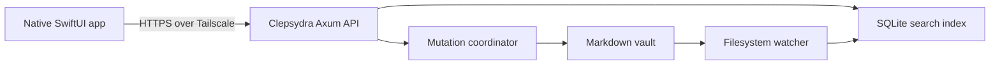

# iPhone Vault Client — Design
> **Superseded (2026-08-08):** The native iOS client was replaced by the responsive web application specified in [`2026-08-08-responsive-mobile-web-design.md`](./2026-08-08-responsive-mobile-web-design.md). This document is retained as historical context and must not be executed.

**Date:** 2026-08-03
**Status:** Approved (design)

## Problem

Clepsydra's vault is available only through the desktop/server experience. The desired MVP is a native iPhone app that can search the configured vault, read notes, create notes, and edit existing notes while the Clepsydra server is online.

The existing Axum API already exposes full-text search and page read/create/update operations. The iPhone app therefore does not need to parse the vault filesystem, embed the Rust core, or reproduce the SQLite index. The remaining design risks are safe remote access and preventing a stale mobile edit from silently overwriting a newer desktop edit.

## Decisions

- Build a native SwiftUI app in a separate iOS project within this repository.
- Treat the Mac-hosted Clepsydra server as authoritative. The app has no offline vault replica.
- Connect only through the user's existing Tailscale network.
- Use the machine's fully qualified MagicDNS name over HTTPS. Configure Clepsydra with a certificate issued for that name and bind it to the Mac's Tailscale address, not a public or all-interface address.
- Use the tailnet and a restrictive Tailscale access policy as the MVP authentication boundary. Do not add Clepsydra application credentials in this MVP.
- Support search, Markdown reading, raw Markdown editing with preview, note creation, and conflict-safe explicit saves.
- Identify existing notes by their stable page UUID. Paths remain display and routing metadata, not mobile identity.
- Add revision-based optimistic concurrency before allowing remote writes.
- Keep the current Markdown vault and mutation coordinator authoritative for every write.

## Goals

1. Search note titles and bodies and open a result.
2. Render a useful Markdown reading view.
3. Edit a note's title and Markdown body, preview it, and explicitly save it.
4. Create a NOTE with a title and optional body without making the iPhone reproduce Clepsydra's path-generation rules.
5. Detect concurrent edits and preserve the user's unsaved mobile draft.
6. Report connectivity, TLS, server, validation, and conflict failures without presenting stale data as saved.

## Non-goals

- Offline reading or editing.
- Background synchronization, a local search index, or a replicated vault.
- Automatic conflict merging.
- Rich/block editing or parity with the desktop Slate editor.
- Delete, move, rename, folders, kind/project assignment, backlinks, graph, tasks, journals, academic records, attachments, archive ingest, or deep links.
- Public-internet exposure of the Clepsydra API.
- Multiple server profiles or multiple vaults.
- App Store distribution work beyond keeping the application compatible with ordinary iOS signing and transport-security requirements.

## Architecture

The app is a thin HTTP client. Search reads the existing index. Page reads and writes use the existing API layer. All writes continue through `MutationCoordinator`; the iOS app never writes a vault file or cache database directly.

The iOS project has four bounded areas:

- `APIClient`: request construction, JSON decoding, HTTP error mapping, and cancellation.
- `VaultSession`: configured server URL and connection state.
- Feature models: search, reader, and editor state transitions.
- SwiftUI views: server setup, search, reader, editor, and Markdown preview.

No iOS component depends on Clepsydra's on-disk layout. Wire models are isolated from view state so backend schema changes do not spread through SwiftUI views.

## Server access and transport

The app stores one non-secret base URL, for example `https://clepsydra.<tailnet>.ts.net:16667`, in application preferences. On setup and launch it verifies connectivity against the existing uptime endpoint before presenting vault features.

The server configuration must:

- bind to the Mac's Tailscale IP;
- enable Clepsydra TLS with certificate and key paths matching the fully qualified MagicDNS hostname;
- remain unreachable from public interfaces; and
- be covered by a Tailscale policy that permits only the intended user/device access.

Tailscale encrypts node-to-node traffic, while the HTTPS layer supplies the certificate semantics expected by iOS transport security. File-based Tailscale certificates expire and require operational renewal; setup documentation must make renewal explicit. The app does not disable certificate validation or add a broad App Transport Security exception.

## API contract

### Existing endpoints retained

- `GET /api/vault/index/search?q={query}&limit={limit}`
- `GET /api/vault/pages/by-id/{uuid}`
- `GET /api/vault/uptime`

Search results already provide `page_id`, `path`, `title`, and `snippet`. Search snippets are treated as text with only the API's fixed highlight markers recognized; arbitrary HTML is never rendered.

### Page revisions

Every page-detail response gains a required `revision` string. The revision is a BLAKE3 digest of the exact serialized page file content used for that response, encoded consistently for the wire contract.

Every update request gains a required `expected_revision`. Updating by stable identity uses:

- `PUT /api/vault/pages/by-id/{uuid}`

The handler resolves the UUID to the current path, reads the current serialized file once, compares its digest with `expected_revision`, and passes that same serialized content to `MutationCoordinator` as the expected content for the atomic mutation. This preserves the check across both possible races:

1. the page changed before the request reached the server; or
2. the page changed after the revision comparison but before the mutation committed.

A mismatch returns `409 Conflict` with a machine-readable conflict code and the current revision. A successful update returns the canonical page detail and its new revision. The existing path-based update contract must adopt the same required revision semantics so desktop and mobile clients have one concurrency rule.

### Server-generated note creation

Add collection creation:

- `POST /api/vault/pages`

The request contains a required non-blank `title` and an optional `body`. The server creates a NOTE, generates the stable UUID and canonical date/slug/short-ID filename, chooses the projected NOTE location using existing vault rules, writes through `MutationCoordinator`, and returns `201 Created` with page detail and revision.

The existing path-addressed create endpoint may remain for workflows that intentionally choose a path, but the iPhone app does not use it.

### OpenAPI

The OpenAPI document includes the new collection-create and UUID-update operations, revision fields, and conflict response. Generated clients remain optional on iOS; the schema is the authoritative wire-contract definition.

## Application flow

### First launch and connection

1. Present a server URL field prefilled only when previously configured.
2. Normalize the URL without changing its scheme or host.
3. Call the uptime endpoint.
4. On success, persist the URL and open search.
5. On failure, retain the entered URL and show an actionable connectivity or TLS error.

The app never asks for the vault path because that remains server configuration.

### Search

1. The search screen is the app root and contains a New Note action.
2. Empty input shows a short instruction rather than downloading the vault.
3. Non-empty input is debounced and sent to the existing full-text endpoint with a bounded result limit.
4. A new query cancels the previous request; late responses cannot replace results for a newer query.
5. Each row shows title fallback, path, and a highlighted snippet.
6. Selecting a row opens the note by `page_id`.

### Read

1. Fetch the page by UUID.
2. Display the title and rendered Markdown body.
3. Preserve the returned UUID, current path, and revision in reader state.
4. Edit opens an editor initialized from that exact response.
5. A read failure keeps navigation intact and offers retry; it does not display an unrelated cached note.

The preview must support the subset Clepsydra authors routinely rely on: headings, paragraphs, emphasis, strong text, lists, task-list markers, block quotes, fenced code, inline code, links, horizontal rules, tables, strikethrough, and wikilink text. In the MVP, ordinary web links open using the system URL handler. Resolvable wikilinks may navigate to a note only when the API provides an unambiguous target; otherwise they remain visibly rendered text rather than guessing.

### Edit and preview

The editor has Edit and Preview modes:

- Edit uses a raw multiline Markdown control.
- Preview renders the current in-memory title/body without contacting the server.
- Save is explicit and disabled while a save is in flight.
- Cancel with no changes returns immediately.
- Cancel with changes asks before discarding.

Save sends the UUID, edited fields, and the revision captured when editing began. On success, the response replaces reader/editor state, including the new revision. On an ordinary failure, the editor and draft remain unchanged.

### Create

1. New Note opens an editor with a required title and empty body.
2. Preview works before creation.
3. Save calls collection creation.
4. Success replaces the draft with the returned UUID, canonical path, and revision, then opens the reader.
5. Validation or network failure leaves the draft intact.

## Conflict behavior

A `409 Conflict` never triggers an automatic retry or overwrite. The app keeps the user's current title/body and presents two actions:

- **Reload server version**: discard the mobile draft only after confirmation, fetch the current page, and replace editor state.
- **Keep draft**: dismiss the conflict message and leave the draft available for copying or manual reconciliation.

There is no force-save action in the MVP. The user must reload, reconcile the content manually, and save against the new revision. This makes data loss harder than conflict resolution.

If the note moved while being edited, UUID-based update resolves its current path and can still succeed when its contents are otherwise unchanged. If the note was deleted, the server returns `404`; the app retains the draft and reports that the source note no longer exists.

## State and lifecycle

- A single `VaultSession` owns the configured base URL and shared `APIClient`.
- Each feature model owns cancellable request state and exposes explicit idle/loading/loaded/failed states.
- Search results and page responses may remain in memory for navigation, but they are not an offline cache and are not shown as authoritative after the server reports a newer revision.
- Unsaved editor content remains owned by the editor model across view recomposition and temporary backgrounding. The app never reports it as saved until the server returns success.
- Changing the configured server clears in-memory vault data before connecting to the replacement.

## Error handling

User-visible failures distinguish:

- Tailscale/server unreachable;
- TLS trust, hostname, or expired-certificate failure;
- malformed server URL;
- request timeout;
- invalid request or title;
- note not found;
- revision conflict; and
- unexpected server or decoding failure.

Errors include Retry only when repeating the same operation is safe. Create and update retries are initiated by the user and reuse the same draft; the server remains responsible for rejecting conflicts or duplicate creation. Raw server internals and filesystem paths are not exposed in generic error copy.

## Testing and verification

### Rust/API contracts

Required observable tests:

1. Page detail includes a stable revision for unchanged serialized content.
2. A successful update changes the revision.
3. An update with a stale revision returns `409` and does not change the file.
4. A change racing between validation and mutation is rejected by the mutation coordinator.
5. UUID-based update follows the page's current indexed path after a move.
6. UUID-based update returns `404` for a missing page.
7. Collection creation produces a NOTE with server-generated UUID, canonical filename, projected location, and revision.
8. Blank-title creation is rejected without writing a file.
9. OpenAPI advertises every required request, response, revision, and conflict schema.
10. Existing desktop page updates send revisions and preserve their current behavior.

### iOS contracts

Required observable tests:

1. Server URL normalization preserves HTTPS and the fully qualified MagicDNS host.
2. Search debouncing and cancellation prevent stale results from replacing a newer query.
3. Search highlight parsing recognizes only the fixed marker and treats other markup literally.
4. Reader state maps page detail and revision correctly.
5. A successful save adopts the returned body, path, and new revision.
6. Network, decoding, and validation failures preserve the draft.
7. Conflict handling never retries or overwrites automatically.
8. Create success transitions from draft to the returned page identity.
9. Markdown preview covers the declared syntax subset with representative fixtures.

### End-to-end smoke check

With Clepsydra bound to its Tailscale address and using a valid MagicDNS certificate:

1. Connect from a physical iPhone on cellular data through Tailscale.
2. Search for a known body term and open the result.
3. Edit and save the note, then observe the exact Markdown change on the Mac.
4. Edit the same note on the Mac after opening it on the phone, then confirm the phone receives a conflict and the Mac edit remains intact.
5. Create a note on the phone and confirm its canonical vault file and search result appear on the Mac.

## Scope boundary

The MVP is complete when the physical-phone smoke check passes for search, read, conflict-safe update, and server-generated creation over Tailscale. Offline support, richer navigation, attachment handling, background sync, rich editing, and additional Clepsydra domains require separate designs rather than extending this client implicitly.
