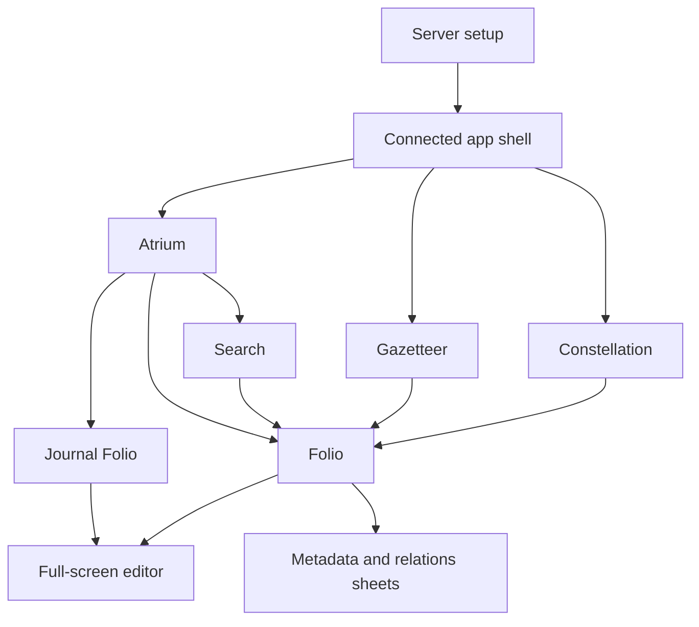

# iOS Main Views — Design

**Date:** 2026-08-07
**Status:** Approved

## Problem

The native iPhone client currently connects to one Clepsydra server and supports search, Markdown reading, note creation, and conflict-safe note editing. It does not yet expose Clepsydra's primary desktop information architecture: Atrium, Folio, Gazetteer, Journal, and Constellation.

The expansion must adapt those views to iPhone rather than copy desktop geometry. The Mac-hosted Clepsydra server remains authoritative; the app remains an online thin client over the existing Tailscale and HTTPS connection.

## Decisions

- Continue with native SwiftUI and the existing `ClepsydraCore`/`ClepsydraUI` package split.
- Target iPhone on iOS 18 or later. iPad-specific layouts are not part of this feature.
- Use three persistent root tabs: Atrium, Gazetteer, and Constellation.
- Treat Folio as the shared page destination pushed from any root, not as a persistent tab.
- Treat Journal as a Folio specialization reached primarily from Atrium and Gazetteer.
- Keep search globally reachable instead of adding a fourth root tab.
- Navigate every page-capable API response by stable page UUID. Paths are display and routing metadata only.
- Preserve the existing full-screen raw-Markdown editor and revision-conflict behavior.
- Use native SwiftUI `Canvas` for Constellation. Do not embed the desktop graph in `WKWebView`.
- Compose Atrium from domain APIs. Do not add a mobile-specific dashboard endpoint.
- Add focused server query capabilities only where mobile payload size or identity correctness requires them.

## Goals

1. Make Atrium the useful default connected screen and daily entry point.
2. Provide a complete mobile Folio for reading, editing, metadata, contents, and page relationships.
3. Support today and recent Journal workflows without creating missing historical entries.
4. Provide scalable Gazetteer browsing, filtering, sorting, and later explicit bulk assignment.
5. Provide a bounded, touch-oriented, accessible Constellation.
6. Preserve search, note creation, online-only operation, and optimistic concurrency.
7. Retain Clepsydra's visual language while honoring native iOS navigation, safe areas, Dynamic Type, Reduce Motion, and VoiceOver.

## Non-goals

- Tasking.
- Offline vault replication, local search indexing, or background synchronization.
- iPad-specific multi-column layouts.
- Desktop workspace tabs, the sheaf, resizable rails, or hover behavior.
- Slate or rich-editor parity.
- Attachments, academic-library workflows, notifications, or deep links.
- Force overwrite or automatic conflict merging.
- Public-internet authentication changes.

## Architecture



`VaultSession` continues to own the configured server and shared `VaultAPI`. `ClepsydraCore` owns wire types, API operations, feature state machines, filtering, derived data, and graph layout. `ClepsydraUI` owns SwiftUI composition and native navigation.

Each root tab owns an independent `NavigationStack`. Switching tabs preserves its navigation path. Changing or disconnecting the configured server clears all loaded vault state.

The shared page navigation value is:

```swift
public struct PageReference: Hashable, Sendable {
    public let id: UUID
    public let path: String
    public let title: String?
}
```

Every search result, content-index entry, journal summary, graph node, backlink, resolved outlink, and similar-page item must either produce a `PageReference` or remain visibly non-navigable.

## API Contracts

### Existing operations retained

- Uptime, search, UUID page read, collection create, and UUID update.
- Stats and tags.
- Backlinks, outlinks, and similar pages.
- Journal today, ensure today, recent journals, and quick capture.
- Graph, BCL, and location.

### Identity hardening

- `ContentEntry` gains stable page UUID.
- `SimilarEntry` gains stable page UUID.
- Existing graph node, backlink, resolved outlink, journal summary, and search-result IDs remain authoritative.
- Mobile page mutations continue using UUID and required revision.
- Later kind/project assignment uses UUID-based endpoints before mobile assignment is enabled.

### Inventory stats contract

`GET /api/vault/index/stats` gains `pages_created_today`, `pages_updated_today`, `pages_created_last_7_days`, and `untagged_pages`. The server computes date windows from its clock in UTC and counts untagged pages with no tag rows. These bounded aggregates let Atrium reproduce desktop inventory without downloading the vault content index.

### Gazetteer query contract

`GET /api/vault/index/content-index` retains `limit` and `offset` and gains optional filtering and sorting:

- `q`: case-insensitive substring over title, path, description, and tags.
- repeated `tag`: all selected tags must match.
- `sort`: `updated`, `created`, `path`, `title`, or `words`.

Filtering and sorting occur before pagination. `updated`, `created`, and `words` sort descending; `path` and `title` sort ascending. Gazetteer exposes every sort except `created`, which Atrium uses for its bounded recently-created query. The response retains `items`, `total`, `limit`, and `offset`.

### Activity query contract

`GET /api/vault/index/activity` accepts `days` in the inclusive range `1...366`, defaulting to `182`. It returns one entry per page whose latest activity falls within the interval: stable page UUID, path, title, and `activity_at`, where `updated_at` takes precedence over `created_at`. Swift derives the calendar grid and streaks from this bounded list.

### Constellation query contract

`GET /api/vault/index/graph` retains its unfiltered form and gains optional bounded queries:

- `anchor_id`: stable page UUID.
- `depth`: `1` or `2`, valid only with `anchor_id`.
- `include_journals`: defaults to `true`.
- `include_orphans`: defaults to `true` for an unanchored graph and has no effect on unreachable nodes in an anchored graph.

The server filters the resolved graph before returning it. Mobile requests a bounded neighborhood by default once an anchor is selected.

## Mobile Information Architecture

### Root tabs

- **Atrium:** daily context, capture/search/new-note actions, inventory, activity, tags, and recent pages.
- **Gazetteer:** paginated vault index with query, tag, and sort state.
- **Constellation:** graph chart plus filters, hubs, orphans, and an accessible node list.

### Folio navigation

Folio is one typed navigation destination shared by all roots. Related-page navigation pushes another Folio in the same root stack. The app does not recreate desktop open-file tabs.

Search is presented from root toolbars and Atrium. Creation remains a full-screen editor flow. Successful creation opens the returned Folio by UUID.

## View Design

### Atrium

Atrium is a vertically scrolling card composition. Core delivery includes greeting and date context, a deterministic daily aphorism, today’s journal, quick capture, search, new note, inventory, top tags, recently edited/created pages, activity, partial loading, pull-to-refresh, and independent card errors.

Later parity adds BCL, Sky/location, Reading Continues through `GET /bases/reading/views/continues` and UUID property patches, and session-local recently opened history. One optional-card failure never replaces the entire Atrium.

### Folio

The existing reader evolves into Folio rather than being replaced. Folio displays title, kind, project, path, timestamps, word count, rendered Markdown, tags, aliases, contents, backlinks, resolved outlinks, and similar pages. Metadata and relationships use toolbar sheets or inline sections instead of side rails.

Editing remains full-screen and explicit. A successful save adopts the returned canonical path, metadata, body, and revision. Ordinary failures and conflicts retain the draft.

### Journal

Today can be written or unwritten. Opening an unwritten today does not create a file. First save uses the journal ensure/create contract. Past missing dates remain absent and cannot be implicitly created.

Journal Folio adds date context, previous/next written-entry navigation, a recent-entry timeline, and quick capture. Journal writes retain normal revision conflict behavior.

### Gazetteer

Gazetteer is a paginated list, not a seven-column table. It supports debounced query, multi-tag AND filtering, sort by updated/path/title/words, progressive row metadata, filter persistence across Folio navigation, and cancellation of stale pages.

Explicit selection mode and bulk kind/project assignment follow the stable read workflow. Partial failures remain visible and successful moves update returned page references.

### Constellation

Constellation is anchor-first on mobile. A SwiftUI `Canvas` supports pan, zoom, and node selection. Controls select an anchor, depth, journal visibility, and orphan visibility. Hubs and orphan information use a sheet. The same visible graph is exposed as an accessible list for VoiceOver and as a fallback when motion or chart interaction is unsuitable.

Graph layout is a pure, deterministic core model given a fixed seed and viewport. Rendering and gestures remain in `ClepsydraUI`. Layout work pauses when the tab is not active.

## State and Data Flow

- `VaultSession` supplies one `VaultAPI` to feature models.
- Atrium, Gazetteer, Journal, and Constellation models expose explicit idle, loading, loaded, refreshing, and failed states; Folio retains its existing reader and editor state machines.
- Query changes cancel prior work; responses are accepted only for the current request generation.
- Atrium cards load concurrently and report errors independently.
- Gazetteer resets pagination when query, tags, or sort change.
- Folio state is keyed by UUID and adopts canonical path changes from the server.
- Journal state distinguishes missing today from transport failure.
- Constellation separates fetched graph data, filter state, layout state, and viewport state.
- Loaded data remains memory-only and is not presented as an offline replica.

## Error Handling

All views distinguish empty content from transport or decoding failure. Retry is offered only for safe reads. Mutation failures preserve user input. A `409 Conflict` never triggers automatic retry or overwrite.

Resolved links navigate by ID. Unresolved links remain rendered text with an explicit unresolved state. Invalid graph filters produce a client validation error before the request. An oversized unbounded graph prompts the user to select an anchor rather than silently dropping nodes.

## Testing

### Rust/API

- Content entries and similar entries expose stable IDs.
- Gazetteer filters use AND tag semantics and the declared text fields.
- Sorting precedes pagination and has deterministic null handling.
- Graph depth returns exactly the reachable resolved subgraph.
- Journal and orphan filters preserve valid edges only.
- OpenAPI includes every new field and query parameter.
- Existing unfiltered desktop contracts remain compatible.

### ClepsydraCore

- Every navigable wire type maps to `PageReference`.
- API request paths, repeated query values, decoding, cancellation, and errors are covered.
- Atrium derived data and stale-response rejection are deterministic.
- Folio contents and related-page mapping are correct.
- Journal unwritten/written transitions never create historical dates.
- Gazetteer pagination resets and rejects stale pages.
- Graph filtering and layout are deterministic for fixed input.

### ClepsydraUI

- Root tabs preserve independent navigation paths.
- Search, Atrium, Gazetteer, Journal, and Constellation open the shared Folio destination.
- Folio exposes metadata and relations without blocking the document.
- Editor presentation and conflict handling remain wired.
- Dynamic Type, VoiceOver labels, Reduce Motion, and empty/error states are covered by focused view tests and simulator smoke checks.

### End-to-end

On a physical iPhone over Tailscale:

1. Connect and open Atrium.
2. Open an unwritten today, write, and save it.
3. Quick-capture into today and observe the content on the Mac.
4. Filter Gazetteer and open a Folio.
5. Follow a backlink to another Folio.
6. Select a Constellation anchor and open a node.
7. Create a desktop/mobile conflict and confirm the mobile draft survives without overwrite.

## Delivery Phases

1. Contract baseline and fixtures.
2. Connected shell.
3. Mobile Folio.
4. Core Atrium.
5. Journal.
6. Gazetteer.
7. Constellation.
8. Peripheral parity, mutations, accessibility, and release hardening.

Each phase is a vertical, reviewable slice with failing tests first and a runnable simulator path. No phase may leave placeholder screens or unused models.

## Success Criteria

The feature is complete when Atrium, Folio, Journal, Gazetteer, and Constellation each have a deliberate native iPhone counterpart; every page transition uses stable identity; all mobile mutations remain revision-safe; Tasking remains absent; project verification gates pass; and the physical-iPhone end-to-end flow succeeds over Tailscale.
