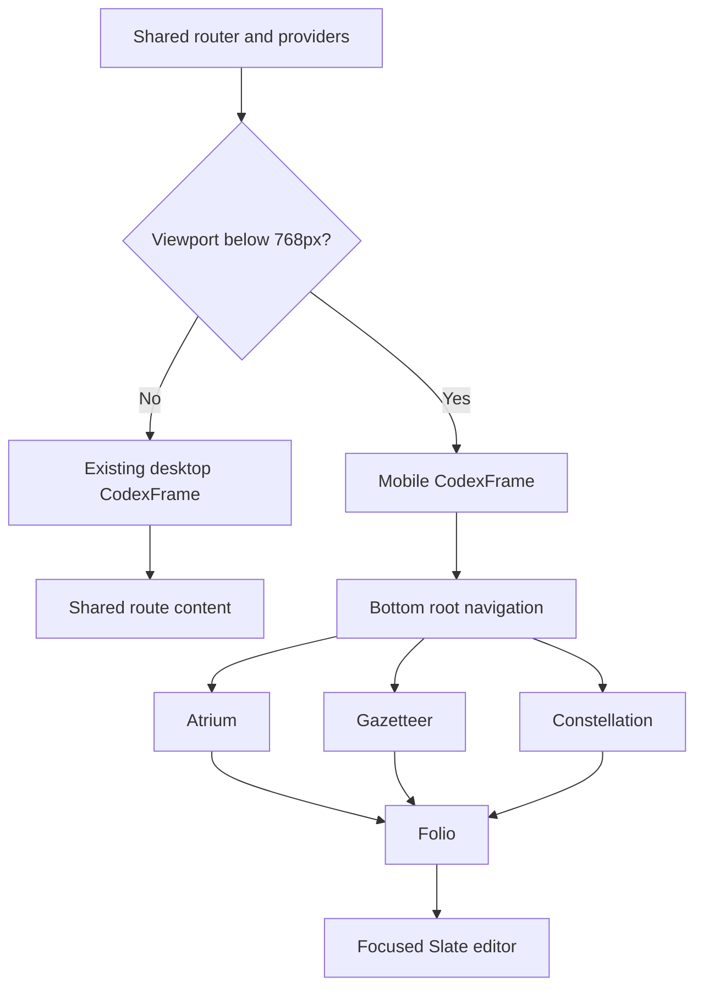

# Responsive Mobile Web — Design

**Date:** 2026-08-08
**Status:** Approved
**Supersedes:** `2026-08-03-ios-vault-client-design.md`, `2026-08-07-ios-main-views-design.md`

## Problem

Clepsydra currently has a desktop-oriented web interface and a separate native iPhone client. Maintaining two clients duplicates navigation, data models, editing behavior, tests, and release work. The existing web interface is already available over tailnet HTTPS, but its dense desktop geometry—header navigation, Sheaf, resizable Folio rails, wide Gazetteer table, and graph controls—is unsuitable for a phone.

Clepsydra will replace the native iOS client with one responsive web application served from the existing tailnet origin. The phone experience will deliberately expose a smaller information architecture rather than compress every desktop feature into a narrow viewport.

## Decisions

- Use one web application, one URL structure, and one API/domain layer for desktop and mobile.
- Treat viewports below `768px` as mobile; `768px` and above retain the desktop presentation.
- Use dedicated mobile presentation components at divergent layout boundaries while sharing API hooks, TanStack Query state, Zustand stores, mutations, encryption state, and the Slate editor.
- Use three persistent mobile roots: Atrium, Gazetteer, and Constellation.
- Treat Folio as a focused page destination reached from any root; Journal remains a Folio specialization.
- Keep search and note creation globally available from the mobile top rail.
- Keep focused rich editing through Slate rather than introducing a raw-Markdown editor.
- Make Tasking and Docs desktop-only.
- Remove the native iOS implementation and native-only tests.
- Preserve the prior iOS specifications and plans as superseded historical records.
- Keep the current localhost server, Caddy HTTPS route, and tailnet boundary. Do not add public-internet authentication, offline replication, or a mobile-only API.

## Goals

1. Serve a deliberate, touch-friendly phone interface at the same tailnet HTTPS origin as desktop Clepsydra.
2. Support Atrium, Gazetteer, Constellation, Folio/Journal, global search, note creation, quick capture, and rich editing on phones.
3. Preserve desktop behavior and capabilities at and above the desktop breakpoint.
4. Reuse existing data, state, mutation, encryption, and conflict-handling contracts.
5. Remove the native iOS codebase and its ongoing maintenance burden.
6. Provide accessible alternatives to dense graph and metadata interactions.

## Non-goals

- Mobile Tasking or Docs.
- Desktop workspace tabs, Sheaf, resizable Folio rails, or hover interactions on phones.
- Offline vault replication, local search indexing, background synchronization, or installable-PWA behavior.
- A separate `/mobile` application, mobile API, or duplicate wire models.
- Public-internet exposure or authentication changes.
- Raw-Markdown editing, force overwrite, or automatic conflict merging.
- Mobile bulk Gazetteer assignment in the initial responsive surface.

## Architecture

A shared `useMobileLayout()` primitive owns the `(max-width: 767px)` media-query contract. It returns the initial match, reacts to viewport changes, and cleans up its listener. Because Clepsydra is a client-rendered Vite application, layout selection occurs in the browser without a server-rendering hydration boundary.

The router, providers, query cache, workspace store, UI store, editor state, and routes remain shared. `CodexFrame` becomes the main presentation boundary:

Dedicated mobile components exist only where geometry or interaction materially diverges. They consume the same hooks and domain state as their desktop counterparts. Responsive components that already collapse cleanly, especially Atrium cards, remain shared.

Viewport changes must not discard the active page, unsaved editor state, route history, query cache, Gazetteer filters, or graph selection. Presentation state that has no meaning in mobile geometry, such as rail width, remains stored but inactive until desktop presentation resumes.

## Navigation

The mobile shell uses the selected bottom-root model:

- `/` — Atrium.
- `/gazetteer` — Gazetteer.
- `/workspace` with an active graph tab — Constellation.
- `/workspace` with an active page tab — Folio.

The top rail contains the Clepsydra identity, search, and new-note actions. The bottom rail contains Atrium, Gazetteer, and Constellation; its active state comes from the URL and, for `/workspace`, the active workspace tab type. Folio is pushed from the current root and relies on browser history for back navigation; it does not become a fourth persistent root.

At mobile widths, direct navigation to `/tasking` or `/docs/*` redirects to Atrium and displays a dismissible desktop-only notice. At desktop widths, these routes remain unchanged.

## Mobile Views

### Atrium

Atrium becomes a one-column scrolling composition. It retains greeting and date context, today’s Journal, quick capture, search, new note, inventory, activity, tags, and recent pages. BCL, Sky/location, and Reading Continues remain available when their current data exists but follow the primary daily actions.

Wide inventory and activity grids collapse into touch-readable cards. Optional card failures stay local; one failed source cannot replace the complete Atrium.

### Folio

Folio uses a single-column reading surface without the desktop left and right rails, resizers, Sheaf, or reading-tick gutter. The header retains title, kind, project, and save status plus a compact overflow action.

Tags, aliases, path, timestamps, contents, backlinks, outlinks, similar pages, encryption actions, and document properties move into touch-friendly sheets or inline disclosures. Related pages continue to open Folio through stable workspace/page state.

Slate remains the editing engine. Mobile editing uses the full content width, touch-sized controls, mobile-safe suggestion popovers, and a compact formatting/action bar. Save state, revision conflicts, wikilink resolution, and encryption behavior remain shared with desktop.

### Journal

Journal remains a Folio specialization. Opening an unwritten today does not create a file. The first write uses the existing ensure/create behavior. Quick capture and recent-entry navigation remain available. Historical missing entries are never implicitly created.

### Gazetteer

Gazetteer is a paginated list rather than the desktop table. Query, tag filters, and sort controls live in a compact filter sheet. Rows progressively expose title, path, kind/project, tags, word count, and modified time.

Query, filter, sort, and pagination state survive navigation into a Folio and back. Bulk selection and assignment are omitted from the initial mobile surface; single-page metadata remains editable through Folio.

### Constellation

Constellation is anchor-first on mobile. It uses the existing graph data and derives the visible anchor-focused subset in the client. The presentation supports touch pan/zoom, node selection, depth control, journal/orphan toggles, and opening the selected node as a Folio.

Hubs and orphan details move into a sheet. The visible graph has a synchronized list representation for accessibility and as a fallback when the graph is too dense for useful phone interaction. An unhelpfully dense graph prompts for an anchor rather than silently discarding nodes.

### Global overlays

Search, command results, settings, encryption dialogs, note creation, and errors use full-height mobile sheets. They use accessible dialog semantics, focus containment, explicit dismissal, and controls sized for touch. Keyboard shortcuts remain registered for attached keyboards but are not advertised as the primary mobile interaction.

## Data Flow

Mobile and desktop consume the same TanStack Query cache, Zustand stores, API hooks, and mutations:

- Atrium uses the current stats, Journal, activity, tags, BCL, and location queries.
- Gazetteer uses the existing content-index query and filtering/sorting domain behavior.
- Constellation uses the existing graph response and derives its focused view client-side.
- Folio uses the existing page editor, assignment, relationship, encryption, and conflict hooks.

No mobile-only endpoint or wire model is introduced. Tailnet loss flows through the existing network error states; loaded data is not presented as an offline replica.

## Error Handling

Every mobile screen distinguishes loading, empty, and failed states. Safe read failures offer retry. Mutation failures preserve user input. Revision conflicts retain the existing explicit reload/reconcile behavior; the client never force-writes or automatically merges.

Atrium cards fail independently. Unresolved related pages remain visible but non-navigable. Constellation uses its accessible list when chart interaction is unsuitable. Unsupported mobile routes redirect with an explanatory notice rather than changing location silently.

## Native Client Cutover

Delete `ios/`, including the Xcode project, Swift packages, native sources, fixtures, and native tests. Remove native-specific scripts and repository references. Update both iOS specification files and both implementation-plan files with a clear superseded notice pointing to this design. Preserve those documents because they record product and API decisions that informed the responsive experience.

Replace native simulator and package verification with responsive-browser verification. The physical-device acceptance target becomes Safari on an iPhone connected to the tailnet.

## Testing

### Automated coverage

- `useMobileLayout()` covers initial state, viewport changes, and listener cleanup.
- Shell tests cover mobile roots and actions, desktop rail preservation, active-root derivation, and mobile-only Tasking/Docs redirects.
- Folio tests cover the absence of rails and preservation of reading, editing, saving, metadata, relationships, encryption, and conflict behavior.
- Gazetteer tests cover list presentation and query/filter/sort persistence across Folio navigation.
- Constellation tests cover anchor selection, list fallback, and Folio navigation.
- Overlay tests cover accessible names, focus containment, touch controls, and dismissal.
- Existing desktop tests remain authoritative. Test setup declares desktop media state where required rather than weakening desktop assertions.
- Repository checks prove no scripts or current documentation still refer to the removed native client.

### Browser verification

Exercise the production application at:

- `390 × 844` — primary iPhone layout.
- `430 × 932` — large iPhone layout.
- `768 × 1024` — desktop/tablet boundary.
- The existing desktop viewport.

At phone widths:

1. Open Atrium and switch all three bottom roots.
2. Search and open a Folio.
3. Read, edit, save, and reopen a note.
4. Open metadata and relationship sheets and follow a backlink.
5. Open today’s Journal and quick-capture.
6. Filter Gazetteer and confirm state survives Folio navigation.
7. Select a Constellation anchor, use touch controls, switch to the accessible list, and open a node.
8. Confirm Tasking and Docs redirect with an explanatory notice.
9. Confirm there is no horizontal page overflow, obscured control, hover-only action, or unsafe-area collision.

## Verification Gates

Before completion, run and report:

- frontend typecheck;
- frontend lint;
- complete frontend test suite;
- complete Rust test suite;
- production frontend build;
- responsive browser smoke flow.

The final device check opens the tailnet HTTPS URL in Safari on a physical iPhone and completes the core read/edit/save flow.

## Success Criteria

The feature is complete when one responsive web application serves desktop and phone clients at the same tailnet HTTPS origin; mobile provides Atrium, Gazetteer, Constellation, Folio/Journal, search, creation, capture, and focused rich editing; desktop behavior remains intact; unsupported mobile routes are explicit; graph and metadata interactions have accessible mobile forms; the native iOS implementation is gone; its documents are marked superseded; all verification gates pass; and the physical-iPhone tailnet flow succeeds.
